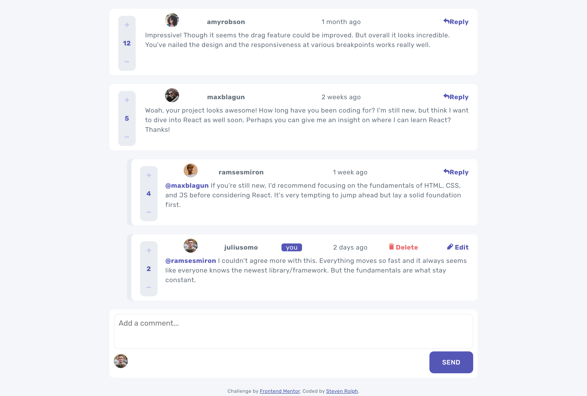

# Frontend Mentor - Interactive comments section solution

This is a solution to the [Interactive comments section challenge on Frontend Mentor](https://www.frontendmentor.io/challenges/interactive-comments-section-iG1RugEG9). Frontend Mentor challenges help you improve your coding skills by building realistic projects.

## Table of contents

- [Overview](#overview)
  - [The challenge](#the-challenge)
  - [Screenshot](#screenshot)
  - [Links](#links)
- [My process](#my-process)
  - [Built with](#built-with)
  - [Changes & Notes](#changes--notes)
  - [Continued development](#continued-development)
- [Author](#author)

## Overview

### The challenge

Users should be able to:

- View the optimal layout for the app depending on their device's screen size ✅
- See hover states for all interactive elements on the page ✅
- Create, Read, Update, and Delete comments and replies ✅
- Upvote and downvote comments ✅
- **Bonus objectives not completed** ❌

### Links

- Solution URL: [https://www.frontendmentor.io/solutions/reactjs-solution-vanilla-css-altered-design-3qq4EDUnSW](https://www.frontendmentor.io/solutions/reactjs-solution-vanilla-css-altered-design-3qq4EDUnSW)
- Live Site URL: [https://valleyman89.github.io/FrontEndMentor-Solution---Interactive-comments-section/](https://valleyman89.github.io/FrontEndMentor-Solution---Interactive-comments-section/)
- GitHub Repo: [https://github.com/valleyman89/FrontEndMentor-Solution---Interactive-comments-section](https://github.com/valleyman89/FrontEndMentor-Solution---Interactive-comments-section)

### Screenshot

## My process

### Built with

- CSS custom properties
- Flexbox
- CSS Grid
- Mobile-first workflow
- [React](https://reactjs.org/) - JS library
- [react-gh-pages](https://github.com/gitname/react-gh-pages) - react-gh-pages - used to deploy the front-end solution on GitHub Pages

### Changes & Notes

- I seperated the original **data.json** file to distinguish between user data and comment data - something which I think would mimc a real-world scenario better.
- A comment/reply must be at least 1 character long, and at most 256 characters.
- Users can only vote once per comment/reply.
- Comment/Reply scores cannot go below 0.
- I thought about switching the + and - buttons on mobile view, which made sense from a UX-perspective, but ultimately I left it.
- I had trouble of adhering to the design spec for replies (the straight gray line on the left hand side). I think this could be achievable if I went back and used CSS grids for the laying out the comments. As a workaround, I used a box-shadow to emulate the line on each individual reply.
- I think I implemented the **.map** function weirdly in **/components/Comments.jsx** and this caused me issues in following the design spec properly - instead I opted for Reply/Update/Delete operations to be presented as a modal box.
- I created a common component called **Button.jsx** but couldn't implement this on the modal discard button as I wasn't sure how to pass through an _onClick_ function as a prop.
- On new comments/replies, I hard-coded the _createdAt_ property as 'a moment ago'

### Continued development

This project is a good opportunity to practice back-end functionaility - so that will be my next project (albeit not on this particular project).

## Author

- GitHub - [@valleyman89](https://github.com/valleyman89)
- Frontend Mentor - [@valleyman89](https://www.frontendmentor.io/profile/valleyman89)
- Twitter - [@steven_rolph](https://twitter.com/steven_rolph)
